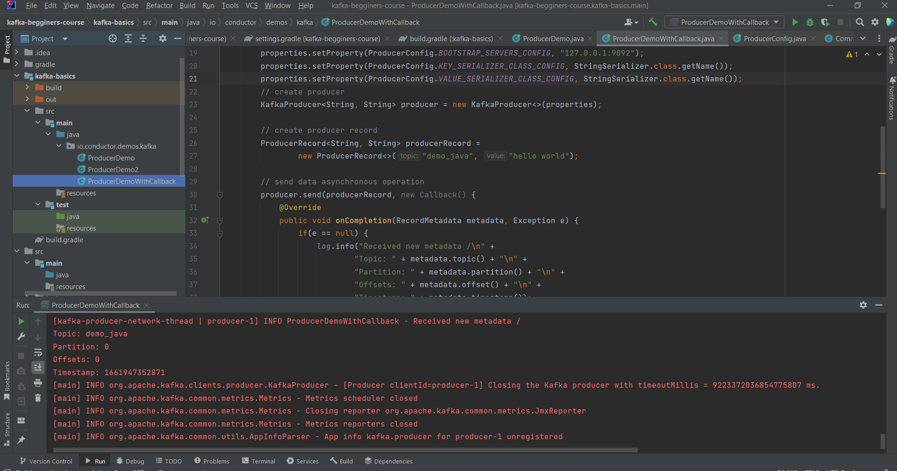

# Kafka project example

### example of run command

C:\kafka_2.13-3.2.1>  .\bin\windows\zookeeper-server-start.bat .\config\zookeeper.properties

C:\kafka_2.13-3.2.1>.\bin\windows\kafka-server-start.bat .\config\server.properties

C:\kafka_2.13-3.2.1>.\bin\windows\kafka-topics.bat --create --topic demo_java --bootstrap-server localhost:9092

